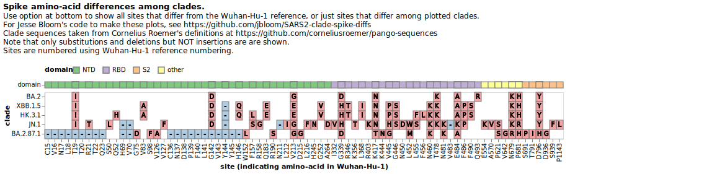

# Make simple plots showing spike amino-acid differences among SARS-CoV-2 Pango clades

This repository contains a simple Jupyter notebook written by Jesse Bloom that makes plots of spike amino-acid mutations in different SARS-CoV-2 Pango clades like this one:

Note that when you make the plots there is an option at the bottom of the plot to show all differences from Wuhan-Hu-1 among the clades as above, or you can just show sites that differ among the clades like below:

The notebook reads the information on Pango clade definitions from Cornelius Roemer's definitions at [https://github.com/corneliusroemer/pango-sequences](https://github.com/corneliusroemer/pango-sequences).
Note that it shows substitutions and deletions, but **not** insertions.

If you just want to input a custom set of clades and make the plot without cloning this repo yourself, use the interactive notebook at [https://mybinder.org/v2/gh/jbloom/SARS2-clade-spike-diffs/main?labpath=spike-diffs.ipynb](https://mybinder.org/v2/gh/jbloom/SARS2-clade-spike-diffs/main?labpath=spike-diffs.ipynb) (this make take a minute to load).

Otherwise, install JupyterLab as well as the packages in [requirements.txt](requirements.txt), open JupyterLab, and run the notebook [spike-diffs.ipynb](spike-diffs.ipynb).